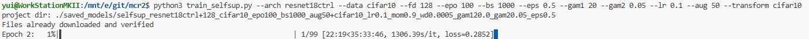

# TODO
- TODO 2024-09-24 git.V.005c2: how to set transformer

# LOG



```bash
root@autodl-container-71f24fb92a-39c98889:~/mcr2# python3 evaluate.py --knn --nearsub  --k 10 --model_dir /root/autodl-tmp/mcrr/selfsup_resnet18ctrl+128_cifar10_epo20_bs1000_aug50+cifar10_lr0.1_mom0.9_wd0.0005_gam120.0_gam20.05_eps0.5/ --data_dir /root/autodl-tmp/
Loading checkpoint: /root/autodl-tmp/mcrr/selfsup_resnet18ctrl+128_cifar10_epo20_bs1000_aug50+cifar10_lr0.1_mom0.9_wd0.0005_gam120.0_gam20.05_eps0.5/checkpoints/model-epoch19.pt
Files already downloaded and verified
extracting all features from dataset: 100%|████████████████████████████████████████████████████████████████████████████████████████████████████████████████████████████████████████████████████████████████████████████████████████████████████████████████████████████████████████████| 250/250 [00:08<00:00, 28.33it/s]
Downloading https://www.cs.toronto.edu/~kriz/cifar-10-python.tar.gz to ./data/cifar10/cifar-10-python.tar.gz
100%|█████████████████████████████████████████████████████████████████████████████████████████████████████████████████████████████████████████████████████████████████████████████████████████████████████████████████████████████████████████████████████████████████| 170498071/170498071 [00:30<00:00, 5618980.93it/s]
Extracting ./data/cifar10/cifar-10-python.tar.gz to ./data/cifar10
extracting all features from dataset: 100%|██████████████████████████████████████████████████████████████████████████████████████████████████████████████████████████████████████████████████████████████████████████████████████████████████████████████████████████████████████████████| 50/50 [00:01<00:00, 29.66it/s]
kNN: 0.11180000000000001
PCA: 0.09519999999999995
SVD: 0.10770000000000002
```
```bash
root@autodl-container-71f24fb92a-39c98889:~/mcr2# python3 evaluate.py --knn --k 10 --model_dir /root/autodl-tmp/mcrr/selfsup_resnet18ctrl+128_cifar10_epo100_bs1000_aug50+cifar10_lr0.1_mom0.9_wd0.0005_gam120.0_gam20.05_eps0.5/
Loading checkpoint: /root/autodl-tmp/mcrr/selfsup_resnet18ctrl+128_cifar10_epo100_bs1000_aug50+cifar10_lr0.1_mom0.9_wd0.0005_gam120.0_gam20.05_eps0.5/checkpoints/model-epoch43.pt
Files already downloaded and verified
extracting all features from dataset: 100%|████████████████████████████████████████████████████████████████████████████████████████████████████████████████████████████████████████████████████████████████████████████████████████████████████████████████████████████████████████████| 250/250 [00:10<00:00, 23.21it/s]
Files already downloaded and verified
extracting all features from dataset: 100%|██████████████████████████████████████████████████████████████████████████████████████████████████████████████████████████████████████████████████████████████████████████████████████████████████████████████████████████████████████████████| 50/50 [00:02<00:00, 24.23it/s]
kNN: 0.10429999999999995
```
# VERSION
- v0.0.2 minor fix
- v0.0.1 fork